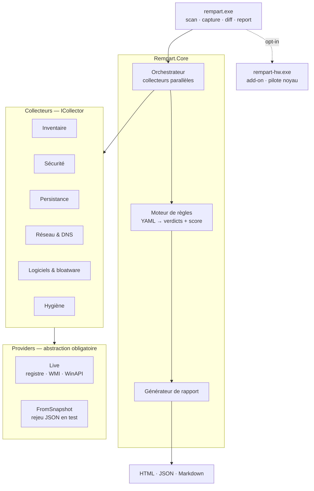
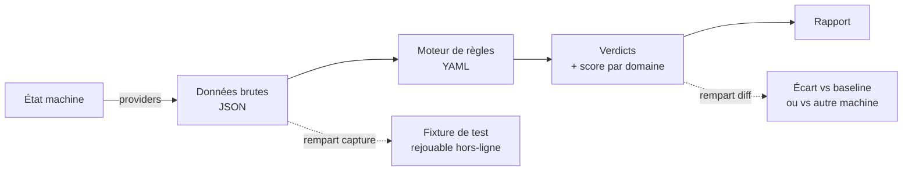

# Architecture — Rempart

Décisions et justifications : [ADR-001](adr/ADR-001-stack-et-perimetre.md).

## Vue d'ensemble



Le point structurant est la couche providers : les collecteurs ne connaissent pas Windows,
seulement l'interface. Le même code tourne contre une machine réelle ou contre un snapshot JSON.

## Flux d'exécution



`rempart capture` est ce qui rend le projet testable : chaque machine auditée devient une
fixture permanente. Une VM vierge n'a aucun bloatware OEM — les machines réelles sont
le seul banc de test valable pour le catalogue logiciels.

**Le dépôt est public**, ce qui impose une séparation stricte :

| Répertoire | Régime | Contenu |
|---|---|---|
| `tests/fixtures/synthetic/` | Versionné | Valeurs fabriquées, aucune machine réelle |
| `tests/fixtures/local/` | Hors dépôt | Captures de machines réelles, rejouées si présentes |

L'anonymisation masque hostname et numéros de série, pas la posture de sécurité. À partir
de M2, une capture réelle révélerait quels contrôles de durcissement sont désactivés sur
une machine identifiable — d'où l'exclusion, et non la seule anonymisation.

## Arborescence

```
rempart/
├── src/
│   ├── Rempart.Cli/            # CLI : scan, capture, explain, synthesise
│   ├── Rempart.Core/
│   │   ├── Collectors/         # ICollector : décrit la machine, ne juge pas
│   │   ├── Engine/             # orchestration, sémantique des champs
│   │   ├── Json/               # sérialisation par génération de source (AOT)
│   │   ├── Providers/          # IRegistryProvider, ISystemInfoProvider
│   │   ├── Rules/              # chargement YAML, évaluation, scoring, liste noire
│   │   └── Snapshots/          # capture, rejeu, anonymisation, fixtures synthétiques
│   └── Rempart.Windows/        # P/Invoke et registre — implémentations Live
├── rules/security/             # les contrôles livrés, embarqués en ressources
├── tests/
│   ├── Rempart.Tests.Unit/
│   └── fixtures/
│       ├── synthetic/          # versionné — produit par « rempart synthesise »
│       └── local/              # hors dépôt — captures de machines réelles
├── scripts/                    # verify.ps1, regenerate-fixtures.ps1
└── .github/workflows/
```

Les répertoires prévus par la feuille de route mais pas encore créés — rapport HTML,
add-on matériel, catalogues bloatware, profils de remédiation, couche image — sont
décrits dans [ROADMAP.md](ROADMAP.md) plutôt qu'annoncés ici comme s'ils existaient.

## Format d'une règle

Une règle est une donnée. Elle est lisible et relisible sans compétence C#.

```yaml
- id: WIN-CRED-001
  title: LSA Protection (RunAsPPL) désactivée
  severity: high                  # info | low | medium | high | critical
  domain: credentials             # regroupe le score ; petit ensemble stable
  rationale: >
    Permet à un attaquant disposant de droits locaux d'extraire les credentials
    depuis la mémoire du processus LSASS.
  references: [CIS-2.3.10, ASD-E8]
  check:
    type: registry                # registry | registryKey | service
    path: HKLM\SYSTEM\CurrentControlSet\Control\Lsa
    value: RunAsPPL
    operator: atLeast             # equals | notEquals | atLeast | exists | absent
    expect: "1"
    windowsDefault: "0"           # ★ voir ci-dessous
  remediation:                    # inerte en v1
    reversibility: trivial        # trivial | reinstallable | restorePointOnly | irreversible
    breaks: >                     # ce qui cesse de fonctionner
      Le chargement des pilotes de sécurité non signés par Microsoft.
    affects: >                    # qui est concerné, et qui ne l'est pas
      Les machines équipées d'un antivirus tiers ancien. Sans antivirus tiers, aucun effet.
    verifyBefore: >               # optionnel, exigé dès que la réversibilité n'est pas triviale
      Relever les pilotes non signés chargés et confirmer la compatibilité.
```

### Remédiation en trois champs, pas un texte libre

Un champ `impact` unique attire les généralités — « peut avoir des effets de bord » —
sur lesquelles aucune décision ne se prend. Les trois questions posées sont celles qu'on
se pose réellement avant d'appliquer un durcissement sur un parc : **qu'est-ce qui cesse
de marcher, qui est concerné, comment le savoir à l'avance.**

« Rien » est une réponse recevable, mais elle doit être écrite. Un test refuse les
réponses trop courtes, et exige `verifyBefore` dès que la réversibilité n'est pas triviale.

`rempart explain <ID>` restitue tout cela : sans cette commande, ces informations
existaient dans les fichiers YAML mais restaient hors de portée à l'usage.

### Contrôles de service

```yaml
check:
  type: service
  path: mpssvc                  # nom du service
  value: state                  # state | startMode
  operator: equals
  expect: running               # running | stopped | paused
                                # automatic | manual | disabled | absent
```

Ce que le registre ne dit pas. Un service peut être configuré en démarrage automatique
et se trouver **arrêté** — parce qu'il a échoué, ou qu'on l'a stoppé. Pour Windows
Update, le pare-feu ou Defender, la différence entre « censé tourner » et « tourne »
est exactement ce qu'un audit doit établir : la configuration peut être irréprochable
pendant que la protection ne s'exécute pas.

`windowsDefault` n'a pas de sens ici et n'est pas exigé : l'état d'un service est
directement observable, il n'existe pas de valeur implicite en cas d'absence.

Un service absent rend `absent`, distinct d'un refus d'accès. Désinstaller un service
qui n'existe pas n'a pas de sens ; un refus appelle une relance en administrateur.

### `appliesWhen` — quand une règle a un sens

Certains contrôles ne valent que dans un contexte. Sans condition, ils produisent du
bruit ailleurs — et le bruit disqualifie un outil d'audit plus sûrement qu'un contrôle
manquant : on cesse de lire des alertes dont la moitié ne s'applique pas.

```yaml
appliesWhen:
  domainJoined: true        # fait machine, via NetGetJoinInformation
  registry:                 # ou condition registre — même format qu'un check
    path: HKLM\SYSTEM\CurrentControlSet\Control\Terminal Server
    value: fDenyTSConnections
    operator: equals
    expect: "0"
    windowsDefault: "1"
```

Une règle écartée rend le verdict `NotApplicable`, distinct de `Unknown` : ici on sait,
et la réponse est qu'il n'y avait rien à vérifier. Il sort du score sans marquer le
rapport comme partiel.

Deux garde-fous. Un bloc `appliesWhen` vide est refusé au chargement — il laisserait
croire à une condition alors que la règle s'applique partout. Et une condition non
vérifiable est tenue pour remplie : mieux vaut rendre un verdict que masquer un contrôle
sur une incertitude, car une règle escamotée ne se remarque pas.

**Conséquence sur la capture.** `rempart capture` lit toutes les clés que les règles
pourraient consulter, y compris celles hors périmètre sur la machine courante. Sans
cela un instantané ne serait rejouable que dans le contexte de sa capture.

### Régénérer les fixtures

```powershell
./scripts/regenerate-fixtures.ps1
```

À lancer après tout changement du catalogue : une règle ajoutée lit une clé que les
fixtures existantes ne contiennent pas, et le rejeu échoue.

Le script s'appuie sur `rempart synthesise`, donc sur les règles chargées par le moteur
lui-même. Une version antérieure reparsait le YAML en expressions régulières — seconde
implémentation du chargeur, ni versionnée ni testée, que personne d'autre ne pouvait
rejouer.

### Règles externes

Les règles livrées sont embarquées dans le binaire — la clé USB doit rester autonome,
sans dossier compagnon à oublier de copier. `--rules <dossier>` en ajoute d'autres :

```
rempart scan    --rules ./mes-regles
rempart explain --rules ./mes-regles
```

Deux usages : itérer sur une règle sans recompiler, et porter des contrôles propres à un
parc que le catalogue livré n'a pas à connaître.

Elles **complètent** le catalogue, elles ne le remplacent pas : une collision
d'identifiant est une erreur, jamais une redéfinition tacite — sinon deux machines
divergeraient sans que le rapport l'indique. La liste noire des composants protégés
s'applique aussi à elles, et c'est là qu'elle compte le plus : une règle externe n'a
pas été relue en pull request.

### `windowsDefault` — le champ qui décide de la justesse

Obligatoire pour tout opérateur de comparaison ; le chargement échoue sans lui.

Sur le registre Windows, **une clé absente est le cas courant, pas l'anomalie**. Le
comportement effectif dépend alors d'un défaut documenté, qui est souvent l'état
souhaité : `UseLogonCredential` absent signifie « pas de mot de passe en clair »,
`NoAutoUpdate` absent signifie « mises à jour actives ».

Une première version traitait toute absence comme un échec. Sur une machine saine, elle
remontait trois alertes `CRITICAL` fausses — de quoi rendre l'outil inutilisable, puisque
plus personne ne lit un rapport qui crie au loup.

Exiger ce champ oblige l'auteur de la règle à connaître le défaut Windows applicable,
ce qui est précisément la connaissance qui rend la règle juste.

### Verdicts et score

| Verdict | Signification |
|---|---|
| `Pass` | Conforme |
| `Fail` | Non conforme |
| `Unknown` | Accès refusé — **jamais** compté comme conforme |

Les verdicts `Unknown` sortent du calcul du score, et un domaine entièrement illisible
vaut `null`, pas zéro : « je ne sais pas » appelle une élévation, « c'est mauvais » appelle
une correction. La pondération par sévérité est non linéaire — dix réglages mineurs ne
compensent pas une faiblesse critique.

Format d'une action de nettoyage :

```yaml
- id: CLEAN-APPX-COPILOT
  layer: B                        # A=image · B=politique · C=composant
  reversibility: reinstallable    # trivial | reinstallable | restore-point-only | irreversible
  impact: "Copilot indisponible. Aucune dépendance système connue."
  survives_feature_update: false  # sera réinstallé par une mise à jour de fonctionnalité
```

## Garanties de sécurité

| Garantie | Mécanisme |
|---|---|
| v1 n'écrit rien | Aucun provider en écriture n'est implémenté avant M9 |
| Composants critiques intouchables | Liste noire codée en dur + test de propriété sur tous les profils en CI |
| Aucune fuite réseau | Sortie externe opt-in par exécution, hors-ligne par défaut |
| Pas d'échec silencieux | Chaque collecteur remonte `insufficient_privileges` plutôt que d'omettre |
| Rollback vérifiable | Journal JSON sur la clé + test VM appliquer → rollback → assert état initial |
| Actions irréversibles isolées | `/ResetBase` et équivalents : jamais dans un profil, confirmation individuelle |

## Stratégie de test

| Niveau | Portée | Exécution | Vitesse |
|---|---|---|---|
| 1 — Unitaire | Moteur de règles, parsing, scoring, rapport | CI, local | ms |
| 2 — Fixtures | Collecteurs sur snapshots réels, sorties golden | CI, local | ms |
| 3 — Intégration | Vrai Windows : ne plante pas, gère l'absence de droits | GH Actions + VM | s |
| 4 — Remédiation | appliquer → vérifier → rollback → assert retour à l'initial | VM Hyper-V | min |

Les niveaux 1 et 2 couvrent l'essentiel du code et tournent à chaque commit.
La VM est réservée au niveau 4, où elle est irremplaçable.

Matrice de snapshots Hyper-V : Win11 Pro 25H2, Win11 Home (SKU différent → politiques
différentes), un snapshot déjà durci pour vérifier l'idempotence.

Hors de portée d'une VM, à tester sur machines physiques : SMART, températures,
throttling, batterie, TPM matériel, bloatware OEM.
