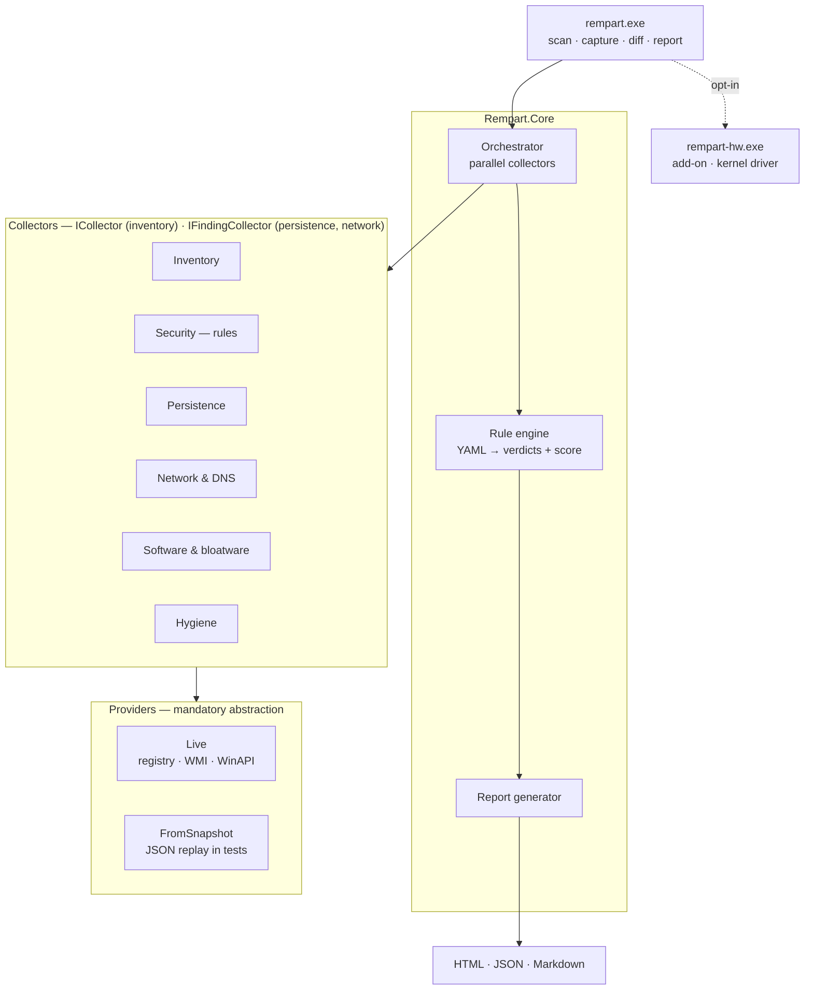
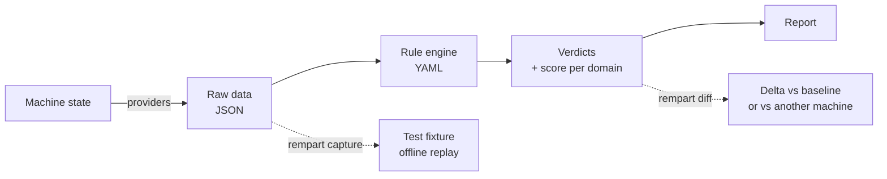
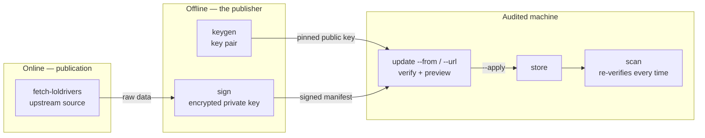

# Architecture — Rempart

Decisions and their rationale: [ADR-001](adr/ADR-001-stack-et-perimetre.md) (French).

## Overview



The structural point is the provider layer: collectors never talk to Windows, only to
the interfaces. The same code runs against a real machine or against a JSON snapshot.

> This diagram is the **target**. Implemented today: inventory, security rules,
> persistence (autoruns, tasks, drivers, WMI, processes, LSA, COM, …), network
> (listening ports cross-checked with the firewall, DNS resolvers, hosts file, proxy
> and PAC, Wi-Fi profiles), software inventory with the bloatware catalog,
> browser extensions with their granted permissions, reclaimable space in the
> component store, and the three report formats with `rempart report`.
> Still to come: hygiene, the hardware add-on, and `diff` — see
> [ROADMAP.md](ROADMAP.md) (French). The update channel, not shown here, has its own
> diagram below.

## Execution flow



`rempart capture` is what makes the project testable: every audited machine becomes a
permanent fixture. A pristine VM has no OEM bloatware — real machines are the only
meaningful test bench for the software catalog.

**The repository is public**, which forces a strict separation:

| Directory | Regime | Content |
|---|---|---|
| `tests/fixtures/synthetic/` | Versioned | Fabricated values, no real machine |
| `tests/fixtures/local/` | Out of the repo | Captures of real machines, replayed when present |

Anonymization masks the hostname and serial numbers, not the security posture. From
M2 onward, a real capture would reveal which hardening controls are disabled on an
identifiable machine — hence exclusion from the repo, not mere anonymization.

## Update channel

Data ages; the binary does not ([ADR-002](adr/ADR-002-mise-a-jour-des-donnees.md),
French). The trust boundary is a signature, never a transport.



What guarantees each link:

| Decision | What it enforces |
|---|---|
| Signature, not transport | `--from` (USB stick) and `--url` (network) run the **same** verification; HTTPS proves nothing |
| Baseline floor (D12) | an update corrects or adds, it **never removes** an embedded check |
| Re-verification at scan (D13) | the scan does not trust the store; a file altered after `--apply` is rejected |
| Never silent (D14/D17) | an update is applied **or** rejected, and the report header says which, with the exact reason |
| Manual key (D16) | no automation holds the private key — otherwise compromising the repository would be enough |

The verification pipeline is single (`UpdatePlanner`); the byte source is injected:
local file or HTTP transport. Same abstraction as the providers, applied to download.

## Directory layout

```
rempart/
├── src/
│   ├── Rempart.Cli/            # CLI: scan, report, capture, explain, synthesise,
│   │                           #   keygen, sign, seal, fetch-loldrivers, update,
│   │                           #   diagnose-*, version
│   ├── Rempart.Core/
│   │   ├── Collectors/         # ICollector: describes the machine via known fields
│   │   ├── Findings/           # IFindingCollector: enumerates persistence (autoruns,
│   │   │                       #   tasks, drivers, WMI, processes, LSA, COM…) and network
│   │   │                       #   (ports, DNS, hosts) + SignatureLadder
│   │   ├── Engine/             # orchestration, field semantics, scoring
│   │   ├── Json/               # source-generated serialization (AOT)
│   │   ├── Packaging/          # the USB stick's signed integrity seal
│   │   ├── Reports/            # pure ScanResult → HTML · Markdown · JSON renderers
│   │   ├── Providers/          # IRegistryProvider, IWmiProvider, IDriverProvider,
│   │   │                       #   IFirewallProvider, IDnsProvider, IListeningPortProvider…
│   │   ├── Rules/              # YAML loading, evaluation, scoring, blocklist
│   │   ├── Snapshots/          # capture, replay, anonymization, synthetic fixtures
│   │   └── Updates/            # signed channel (ADR-002): manifest, verification,
│   │                           #   signature, store, LOLDrivers, HTTP transport
│   └── Rempart.Windows/        # P/Invoke, registry, WMI, tasks — Live implementations
├── rules/security/             # the shipped checks, embedded as resources
├── tests/
│   ├── Rempart.Tests.Unit/     # engine, rules, channel — no Windows required
│   ├── Rempart.Tests.Windows/  # real registry, WMI, tasks, drivers — Windows only
│   └── fixtures/
│       ├── synthetic/          # versioned — produced by "rempart synthesise"
│       └── local/              # out of the repo — captures of real machines
├── scripts/                    # verify.ps1, regenerate-fixtures.ps1
└── .github/workflows/
```

Two collector families, deliberately distinct. `ICollector` describes fields known in
advance (model, build, state of a service); `IFindingCollector` **enumerates** what is
present — autorun programs, tasks, drivers, listening ports — and judges each element.
The two never mix in the score: a 94 % configuration must not hide an unsigned kernel
driver or a network-exposed port.

Directories planned by the roadmap but not created yet — HTML report, hardware add-on,
remediation profiles, image layer — are described in [ROADMAP.md](ROADMAP.md) rather
than announced here as if they existed.

## Reports

Rendering is a pure function of the scan: `ScanResult → text`, with no filesystem, no
clock, no Windows. `rempart report --from <rapport.json>` therefore runs anywhere, and
both renderers are tested by property rather than by screenshot.

| Format | Reader | Content |
|---|---|---|
| HTML | whoever opens it | summary, flagged findings, benign ones folded away |
| Markdown | whoever pastes it into a ticket | the same, with nothing folded — plain text is read as often as rendered |
| JSON | the next tool | **complete**, benign findings included; source for `report` and for `diff` (M7) |

The HTML is one file: inline stylesheet and script, no external reference of any kind.
One would turn opening a report into a network call from the reader's machine, and would
disclose that it was opened.

**A report is built from strings the audited machine chose** — command lines, paths,
extension names. Escaping is not cosmetic here: it is the one place where a formatting
mistake becomes a vulnerability. The inline script receives no scan data at all; it
filters nodes already in the document, which removes the second injection path instead of
securing it.

Provenance travels inside `ScanResult` — `UpdateNote`, `IntegrityNote`, `RulesNote` —
rather than beside it. Otherwise re-rendering from the JSON would drop the sentence "the
update was refused", exactly the silence [ADR-002](adr/ADR-002-mise-a-jour-des-donnees.md)
(D14, D17) forbids.

## The stick

```
E:\
├── rempart.exe                       # sealed
├── rules/                            # sealed — loaded without an option
├── rempart-data/                     # excluded: re-verified at every scan (D13)
├── reports/<machine>-<date>/         # excluded: written by every scan
└── rempart-integrity.json            # the seal itself
```

`rules/` and `rempart-data/` are found beside the binary with nothing to configure: the
stick is plugged in and run. Extra rules are never picked up silently — the scan header
names the folder, and the catalog fingerprint changes.

`rempart seal` signs the listing with the publisher key of ADR-002 — the same trust
anchor as the update channel. A bare list of hashes stored next to the files it describes
would protect against nothing: whoever alters a file recomputes the line. An **added**
file is reported like a modified one, because planting is done by adding a DLL beside the
executable, not by editing something the seal already lists.

Its limit is stated wherever it appears: a binary verifying itself proves little. The
check is worth something run from a copy known to be good, against a stick one has reason
to doubt.

## Rule format

A rule is data. It can be read and reviewed without knowing C#.

```yaml
- id: WIN-CRED-001
  title: LSA Protection (RunAsPPL) désactivée
  severity: high                  # info | low | medium | high | critical
  domain: credentials             # groups the score; small stable set
  rationale: >
    Permet à un attaquant disposant de droits locaux d'extraire les credentials
    depuis la mémoire du processus LSASS.
  references: [CIS-2.3.10, ASD-E8]
  check:
    type: registry                # registry | registryKey | service | policy | wmi
    path: HKLM\SYSTEM\CurrentControlSet\Control\Lsa
    value: RunAsPPL
    operator: atLeast             # equals | notEquals | atLeast | atMost | exists | absent
    expect: "1"
    windowsDefault: "0"           # ★ see below
  remediation:                    # inert in v1
    reversibility: trivial        # trivial | reinstallable | restorePointOnly | irreversible
    breaks: >                     # what stops working
      Le chargement des pilotes de sécurité non signés par Microsoft.
    affects: >                    # who is affected, and who is not
      Les machines équipées d'un antivirus tiers ancien. Sans antivirus tiers, aucun effet.
    verifyBefore: >               # optional, required when reversibility is not trivial
      Relever les pilotes non signés chargés et confirmer la compatibilité.
```

Rule texts (title, rationale, remediation) are currently written in French — they are
what `scan` and `explain` print. Their translation is tracked in the roadmap.

### Remediation as three fields, not free text

A single `impact` field attracts generic statements — "may have side effects" — on
which no decision can be made. The three questions asked are the ones actually asked
before hardening a fleet: **what stops working, who is affected, how to check in
advance.**

"Nothing" is an acceptable answer, but it must be written. A test rejects answers
that are too short, and requires `verifyBefore` whenever reversibility is not trivial.

`rempart explain <ID>` prints all of it. Before that command existed, this
information sat in the YAML files and was out of reach at the moment of use.

### Service checks

```yaml
check:
  type: service
  path: mpssvc                  # service name
  value: state                  # state | startMode
  operator: equals
  expect: running               # running | stopped | paused
                                # automatic | manual | disabled | absent
```

This covers what the registry does not say. A service can be configured for automatic
start and currently be **stopped** — because it failed, or was stopped manually. For
Windows Update, the firewall, or Defender, the difference between "supposed to run"
and "running" is exactly what an audit must establish: the configuration can be
flawless while the protection is not executing.

`windowsDefault` is meaningless here and not required: a service state is directly
observable; there is no implicit value when it is absent.

An absent service yields `absent`, distinct from an access denial. Uninstalling a
service that does not exist makes no sense; a denial calls for an elevated re-run.

### `appliesWhen` — when a rule makes sense

Some checks are only meaningful in context. Without a condition they produce noise
everywhere else, and half-irrelevant alerts get an audit report ignored.

```yaml
appliesWhen:
  domainJoined: true        # machine fact, via NetGetJoinInformation
  registry:                 # or a registry condition — same format as a check
    path: HKLM\SYSTEM\CurrentControlSet\Control\Terminal Server
    value: fDenyTSConnections
    operator: equals
    expect: "0"
    windowsDefault: "1"
```

A rule ruled out yields the verdict `NotApplicable`, distinct from `Unknown`: here we
do know, and the answer is that there was nothing to check. It leaves the score
without marking the report as partial.

Two safeguards. An empty `appliesWhen` block is rejected at load time — it would
suggest a condition where the rule actually applies everywhere. And a condition that
cannot be evaluated counts as met: better to produce a verdict than to hide a check
on an uncertainty, because a skipped rule goes unnoticed.

**Consequence for capture.** `rempart capture` reads every key the rules could
consult, including those out of scope on the current machine. Otherwise a snapshot
would only be replayable in the context it was captured in.

### Regenerating fixtures

```powershell
./scripts/regenerate-fixtures.ps1
```

Run it after any catalog change: an added rule reads a key that existing fixtures do
not contain, and replay fails.

The script relies on `rempart synthesise`, i.e. on the rules as loaded by the engine
itself. An earlier version re-parsed the YAML with regular expressions — a second,
unversioned, untested implementation of the loader that nobody else could reproduce.

### External rules

Shipped rules are embedded in the binary — the USB stick must stay self-contained,
with no companion folder to forget. `--rules <dir>` adds more:

```
rempart scan    --rules ./my-rules
rempart explain --rules ./my-rules
```

Two uses: iterating on a rule without recompiling, and carrying fleet-specific checks
the shipped catalog has no reason to know about.

External rules **extend** the catalog, they do not replace it: an identifier
collision is an error, never a tacit redefinition — otherwise two machines would
diverge without the report saying so. The protected-component blocklist applies to
them too, and that is where it matters most: an external rule was never reviewed in
a pull request.

### `windowsDefault` — the field that decides correctness

Mandatory for every comparison operator; loading fails without it.

On the Windows registry, **an absent key is the common case, not the anomaly**. The
effective behavior then follows a documented default, which is often the desired
state: `UseLogonCredential` absent means "no cleartext password",
`NoAutoUpdate` absent means "updates enabled".

A first version treated every absence as a failure and reported three false
`CRITICAL` findings on a healthy machine — enough to make the tool unusable, since
nobody keeps reading a report that cries wolf.

Requiring the field forces the rule author to know the applicable Windows default,
which is precisely the knowledge that makes the rule correct.

### Verdicts and score

| Verdict | Meaning |
|---|---|
| `Pass` | Compliant |
| `Fail` | Non-compliant |
| `Unknown` | Access denied — **never** counted as compliant |

`Unknown` verdicts leave the score computation, and a fully unreadable domain scores
`null`, not zero: "I don't know" calls for elevation, "it's bad" calls for a fix.
Severity weighting is non-linear — ten minor settings do not offset one critical
weakness.

### Cleanup actions (planned, M9)

Remediation ships in a later milestone; its data format is already settled:

```yaml
- id: CLEAN-APPX-COPILOT
  layer: B                        # A=image · B=policy · C=component
  reversibility: reinstallable    # trivial | reinstallable | restore-point-only | irreversible
  impact: "Copilot indisponible. Aucune dépendance système connue."
  survives_feature_update: false  # will be reinstalled by a feature update
```

## Security guarantees

| Guarantee | Mechanism |
|---|---|
| v1 writes nothing | No write-capable provider exists before M9 |
| Critical components untouchable | Hard-coded blocklist + property test over all profiles in CI |
| No network leakage | External calls are opt-in per run; offline by default |
| No silent failure | Every collector reports `insufficient_privileges` rather than omitting |
| Verifiable rollback *(planned, M9)* | JSON journal on the stick + VM test: apply → rollback → assert initial state |
| Irreversible actions isolated *(planned, M9)* | `/ResetBase` and equivalents: never in a profile, individually confirmed |

## Test strategy

| Level | Scope | Runs | Speed |
|---|---|---|---|
| 1 — Unit | Rule engine, parsing, scoring, report | CI, local | ms |
| 2 — Fixtures | Collectors on real snapshots, golden outputs | CI, local | ms |
| 3 — Integration | Real Windows: does not crash, handles missing privileges | GH Actions + VM | s |
| 4 — Remediation | apply → verify → rollback → assert back to initial | Hyper-V VM | min |

Levels 1 and 2 cover most of the code and run on every commit. The VM is reserved
for level 4, where nothing else will do.

Hyper-V snapshot matrix: Win11 Pro 25H2, Win11 Home (different SKU → different
policies), one already-hardened snapshot to verify idempotence.

Out of a VM's reach, to be tested on physical machines: SMART, temperatures,
throttling, battery, hardware TPM, OEM bloatware.
