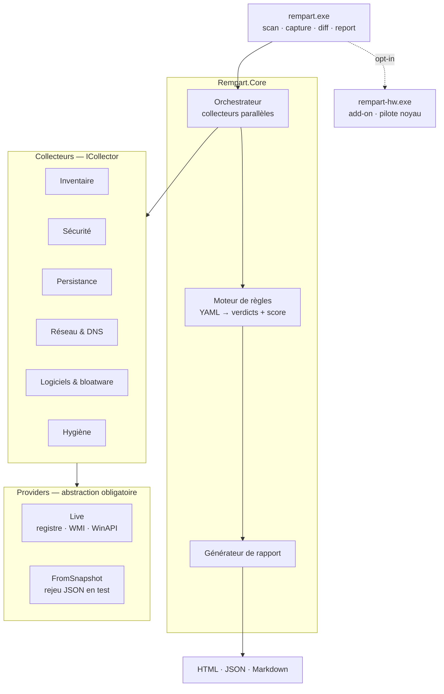
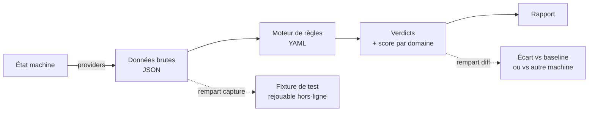

# Architecture — Rempart

Décisions et justifications : [ADR-001](adr/ADR-001-stack-et-perimetre.md).

## Vue d'ensemble



Le point structurant est la couche providers : les collecteurs ne connaissent pas Windows,
seulement l'interface. Le même code tourne contre une machine réelle ou contre un snapshot JSON.

## Flux d'exécution



`rempart capture` est ce qui rend le projet testable : chaque machine auditée devient une
fixture permanente. Une VM vierge n'a aucun bloatware OEM — les machines réelles sont
le seul banc de test valable pour le catalogue logiciels.

**Le dépôt est public**, ce qui impose une séparation stricte :

| Répertoire | Régime | Contenu |
|---|---|---|
| `tests/fixtures/synthetic/` | Versionné | Valeurs fabriquées, aucune machine réelle |
| `tests/fixtures/local/` | Hors dépôt | Captures de machines réelles, rejouées si présentes |

L'anonymisation masque hostname et numéros de série, pas la posture de sécurité. À partir
de M2, une capture réelle révélerait quels contrôles de durcissement sont désactivés sur
une machine identifiable — d'où l'exclusion, et non la seule anonymisation.

## Arborescence

```
rempart/
├── src/
│   ├── Rempart.Cli/              # System.CommandLine, orchestration, sortie
│   ├── Rempart.Core/
│   │   ├── Collectors/         # ICollector : Collect() → JSON, isolés, parallèles
│   │   ├── Providers/          # IRegistryProvider, IWmiProvider… + Live / FromSnapshot
│   │   ├── Rules/              # Chargement YAML, évaluation, scoring
│   │   └── Report/             # HTML autonome, JSON, Markdown
│   ├── Rempart.Windows/          # P-Invoke, WMI, registre — implémentations Live
│   └── Rempart.Hardware/         # Add-on, publié séparément
├── rules/
│   ├── security/               # defender.yaml, credentials.yaml, legacy.yaml, network.yaml…
│   ├── bloatware/              # oem.yaml, microsoft.yaml
│   ├── baselines/              # cis-win11.yaml, essential8.yaml
│   └── profiles/               # standard.yaml, durci.yaml, paranoiaque.yaml
├── image/                      # autounattend.xml versionné — couche A
├── tests/
│   ├── Rempart.Tests.Unit/     # moteur, scoring, parsing, rejeu de fixtures
│   └── fixtures/
│       ├── synthetic/          # versionné — valeurs fabriquées
│       └── local/              # hors dépôt — captures de machines réelles
├── scripts/                    # cycle de test Hyper-V
└── .github/workflows/
```

## Format d'une règle

Une règle est une donnée. Elle est lisible et relisible sans compétence C#.

```yaml
- id: WIN-LSA-001
  title: LSA Protection (RunAsPPL) désactivée
  severity: high
  domain: credentials
  rationale: >
    Permet à un attaquant disposant de droits locaux d'extraire les credentials
    depuis la mémoire du processus LSASS.
  references: [CIS-2.3.10.x, ASD-E8]
  check:
    type: registry
    path: HKLM\SYSTEM\CurrentControlSet\Control\Lsa
    value: RunAsPPL
    expect: 1
  remediation:                    # inerte en v1
    reversibility: trivial
    impact: >
      Peut empêcher le chargement de pilotes de sécurité tiers non signés.
```

Format d'une action de nettoyage :

```yaml
- id: CLEAN-APPX-COPILOT
  layer: B                        # A=image · B=politique · C=composant
  reversibility: reinstallable    # trivial | reinstallable | restore-point-only | irreversible
  impact: "Copilot indisponible. Aucune dépendance système connue."
  survives_feature_update: false  # sera réinstallé par une mise à jour de fonctionnalité
```

## Garanties de sécurité

| Garantie | Mécanisme |
|---|---|
| v1 n'écrit rien | Aucun provider en écriture n'est implémenté avant M9 |
| Composants critiques intouchables | Liste noire codée en dur + test de propriété sur tous les profils en CI |
| Aucune fuite réseau | Sortie externe opt-in par exécution, hors-ligne par défaut |
| Pas d'échec silencieux | Chaque collecteur remonte `insufficient_privileges` plutôt que d'omettre |
| Rollback vérifiable | Journal JSON sur la clé + test VM appliquer → rollback → assert état initial |
| Actions irréversibles isolées | `/ResetBase` et équivalents : jamais dans un profil, confirmation individuelle |

## Stratégie de test

| Niveau | Portée | Exécution | Vitesse |
|---|---|---|---|
| 1 — Unitaire | Moteur de règles, parsing, scoring, rapport | CI, local | ms |
| 2 — Fixtures | Collecteurs sur snapshots réels, sorties golden | CI, local | ms |
| 3 — Intégration | Vrai Windows : ne plante pas, gère l'absence de droits | GH Actions + VM | s |
| 4 — Remédiation | appliquer → vérifier → rollback → assert retour à l'initial | VM Hyper-V | min |

Les niveaux 1 et 2 couvrent l'essentiel du code et tournent à chaque commit.
La VM est réservée au niveau 4, où elle est irremplaçable.

Matrice de snapshots Hyper-V : Win11 Pro 25H2, Win11 Home (SKU différent → politiques
différentes), un snapshot déjà durci pour vérifier l'idempotence.

Hors de portée d'une VM, à tester sur machines physiques : SMART, températures,
throttling, batterie, TPM matériel, bloatware OEM.
