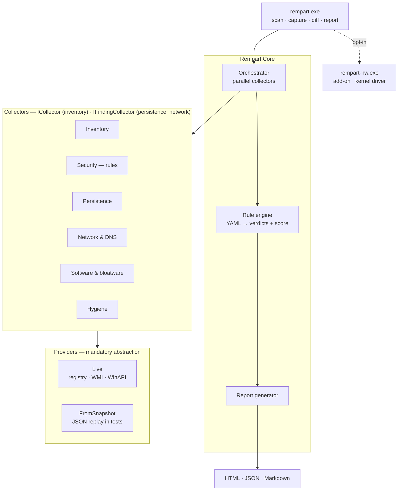
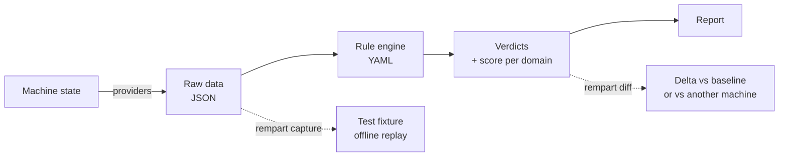
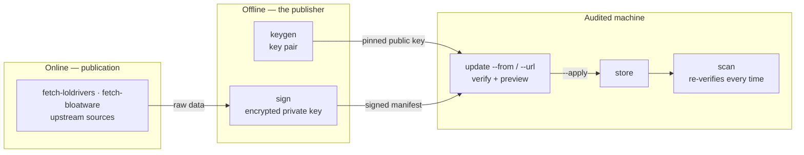
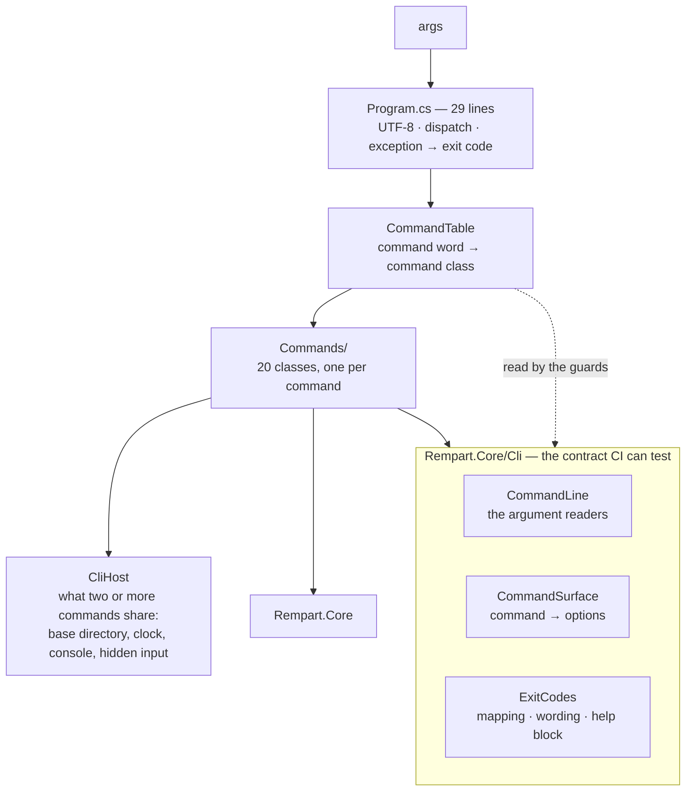

# Architecture — Rempart

Decisions and their rationale are recorded in ADRs (French):

- [ADR-001](adr/ADR-001-stack-et-perimetre.md) — stack and scope
- [ADR-002](adr/ADR-002-mise-a-jour-des-donnees.md) — signed data updates
- [ADR-003](adr/ADR-003-pare-feu-par-registre.md) — reading the firewall through the registry rather than COM
- [ADR-004](adr/ADR-004-etat-systeme-en-champ-dedie.md) — bulky system state in a dedicated snapshot field
- [ADR-005](adr/ADR-005-decoupage-de-la-couche-cli.md) — splitting the CLI layer, generalising the providers
- [ADR-006](adr/ADR-006-catalogue-bloatware-importe.md) — importing the bloatware catalogue's identifiers, keeping the judgement here
- [ADR-007](adr/ADR-007-perimetre-v2-et-ecriture.md) — what v2 is, and how a write is proven (*proposed*)

## Overview


```mermaid
flowchart TB
    CLI["rempart.exe<br/>scan · capture · diff · report"]

    subgraph CORE["Rempart.Core"]
        ORCH["Orchestrator<br/>parallel collectors"]
        RULES["Rule engine<br/>YAML → verdicts + score"]
        REPORT["Report generator"]
    end

    subgraph COL["Collectors — ICollector (inventory) · IFindingCollector (persistence, network)"]
        C1["Inventory"]
        C2["Security — rules"]
        C3["Persistence"]
        C4["Network & DNS"]
        C5["Software & bloatware"]
        C6["Hygiene"]
    end

    subgraph PROV["Providers — mandatory abstraction"]
        PLIVE["Live<br/>registry · WMI · WinAPI"]
        PSNAP["FromSnapshot<br/>JSON replay in tests"]
    end

    HW["rempart-hw.exe<br/>add-on · kernel driver"]

    CLI --> ORCH
    ORCH --> COL
    COL --> PROV
    ORCH --> RULES
    RULES --> REPORT
    REPORT --> OUT["HTML · JSON · Markdown"]
    CLI -.opt-in.-> HW
```

The structural point is the provider layer: collectors never talk to Windows
directly, only to provider interfaces. The same collector code runs against a real
machine or against a JSON snapshot.

> The diagram shows the **target**. Implemented today: inventory, security rules,
> persistence (autoruns, tasks, drivers, WMI, processes, LSA, COM, …), network
> (listening ports cross-checked with the firewall, DNS resolvers, hosts file, proxy
> and PAC, Wi-Fi profiles), software inventory with the bloatware catalog, browser
> extensions with their granted permissions, reclaimable space in the component
> store, the three report formats with `rempart report`, and fleet work —
> `rempart diff` and the aggregation page. Still to come: hygiene and the hardware
> add-on — see [ROADMAP.md](ROADMAP.md) (French). The update channel has its own
> diagram below.

## Execution flow


```mermaid
flowchart LR
    A["Machine state"] -->|providers| B["Raw data<br/>JSON"]
    B --> C["Rule engine<br/>YAML"]
    C --> D["Verdicts<br/>+ score per domain"]
    D --> E["Report"]
    B -.->|rempart capture| F["Test fixture<br/>offline replay"]
    D -.->|rempart diff| G["Delta vs baseline<br/>or vs another machine"]
```

`rempart capture` is what makes the project testable: any audited machine can be
turned into a permanent test fixture.

The bloatware catalogue is the one surface a test bench cannot close. A pristine VM
has no OEM bloatware, and a single real machine would validate one vendor and leave
the rest unseen. So catalogue **coverage** is treated as data: identifiers are
imported from a pinned upstream list, and the judgement — what each entry is, what
removing it costs — stays in this repository
([ADR-006](adr/ADR-006-catalogue-bloatware-importe.md), French). A real capture
still adds something: it turns an impact note from *described upstream* into
*verified here*.

**The repository is public**, which forces a strict separation:

| Directory | Regime | Content |
|---|---|---|
| `tests/fixtures/synthetic/` | Versioned | Fabricated posture and threat material, machine identity scrubbed |
| `tests/fixtures/local/` | Out of the repo | Captures of real machines, replayed when present |

Anonymization masks the hostname and serial numbers, not the security posture. A
real capture would reveal which hardening controls are disabled on an identifiable
machine — which is why real captures are excluded from the repo, not merely
anonymized.

**What a synthetic fixture is:** a real capture whose *form* is kept and whose
*identity* is scrubbed — not a machine invented from nothing.

| | |
|---|---|
| **Fabricated** | Everything a rule reads. The posture is generated by `rempart synthesise` from the rule catalogue, and the intrusion markers are invented on purpose — RFC 5737 addresses, digests of repeated `deadbeef`. No verdict in these files was ever observed on a real machine. |
| **Scrubbed** | The identity: hostname, serial numbers, registered owner, account names in profile paths, SSIDs, proxy hosts, browser-profile salts, hardware identity (mainboard model, BIOS version and date), and the path and name of every scheduled task outside `\Microsoft\` — folders a partly refused task walk names included, by the same rule. `Anonymiser.Apply` runs over the output of `synthesise`, so the `anonymised` flag is produced, not asserted. |
| **Inherited** | The shape, deliberately: a couple of hundred scheduled tasks, several hundred verified signatures, the paths of the executables they point at. The audit's job is to pick the right line out of a crowd, and a fixture with three tidy entries would not test that. A reader can still tell which publishers were installed on the source machine; nobody can tell which machine it was. |

**The four versioned fixtures.** All four replay on every commit, and each freezes a
JSON report and a console rendering. Each proves something the others cannot:

| Fixture | Posture | What it alone proves |
|---|---|---|
| `default-win11` | Windows defaults, elevated | The report of a machine nobody hardened: 52/100, 49 failing controls. Exits `5` — `WIN-ENC-001` is unverifiable even elevated |
| `hardened-win11` | Hardened, elevated | 100/100, no `Unknown` — the only fixture that exits `0`, so the success path is exercised too |
| `restricted-access` | Hardened, **not** elevated, LSA denied | A perfect score built on partial visibility: 100/100 with four controls `Unknown`. This case is why exit code `5` exists |
| `compromised-win11` | Windows defaults, elevated, **intrusion planted** | 7 `Suspicious` and 3 `Notable` findings. Before it existed, every reference output froze "nothing found" — the same reassuring shape a broken scan has |

`rempart synthesise --compromised` plants the intrusion; `--profile` picks the
posture independently, so a hardened-and-compromised machine stays expressible. The
pair `default-win11 → compromised-win11` — a machine re-scanned after an intrusion —
is the comparison the tool exists for, and it is frozen as a golden diff alongside
the three others.

## Update channel

Data ages; the binary does not ([ADR-002](adr/ADR-002-mise-a-jour-des-donnees.md),
French). The trust boundary is a signature, never a transport.


```mermaid
flowchart LR
    subgraph OFF["Offline — the publisher"]
        K["keygen<br/>key pair"]
        S["sign<br/>encrypted private key"]
    end
    subgraph PUB["Online — publication"]
        F["fetch-loldrivers · fetch-bloatware<br/>upstream sources"]
    end
    subgraph AUD["Audited machine"]
        U["update --from / --url<br/>verify + preview"]
        ST["store"]
        SC["scan<br/>re-verifies every time"]
    end

    K -->|pinned public key| U
    F -->|raw data| S
    S -->|signed manifest| U
    U -->|--apply| ST
    ST --> SC
```

What guarantees each link:

| Decision | What it enforces |
|---|---|
| Signature, not transport | `--from` (USB stick) and `--url` (network) run the **same** verification; HTTPS proves nothing |
| Baseline floor (D12) | An update corrects or adds; it **never removes** an embedded check |
| Re-verification at scan (D13) | The scan does not trust the store: a file altered after `--apply` is rejected |
| Never silent (D14/D17) | An update is applied **or** rejected, and the report header says which, with the exact reason |
| Manual key (D16) | No automation holds the private key — otherwise compromising the repository would be enough |

The verification pipeline is single (`UpdatePlanner`); only the byte source is
injected — local file or HTTP transport. Same abstraction as the providers, applied
to downloads.

## Directory layout

```
rempart/
├── global.json                 # the SDK version, pinned
├── Directory.Build.props       # settings shared by every project
├── Directory.Packages.props    # every package version, declared centrally
├── src/
│   ├── Rempart.Cli/            # net10.0-windows — the host, and only the host
│   │   ├── Program.cs          # 29 lines: console encoding, dispatch, exception → exit code
│   │   ├── CommandTable.cs     # command word → command class, written out by hand
│   │   ├── CliHost.cs          # what two or more commands share, and only the host can answer
│   │   └── Commands/           # one class per command: scan, report, diff, index, capture,
│   │                           #   explain, synthesise, keygen, sign, seal, update,
│   │                           #   fetch-loldrivers, fetch-bloatware, version, help, and
│   │                           #   diagnose-{wmi,tasks,drivers,processes,store}
│   ├── Rempart.Core/           # net10.0 — no Windows, so the Linux job compiles and tests it
│   │   ├── Cli/                # the CLI contract that must be testable: ExitCodes,
│   │   │                       #   CommandLine (parsing), CommandSurface (command → options)
│   │   ├── Collectors/         # ICollector: describes the machine via known fields
│   │   ├── Findings/           # IFindingCollector: enumerates persistence (autoruns,
│   │   │                       #   tasks, drivers, WMI, processes, LSA, COM…) and network
│   │   │                       #   (ports, DNS, hosts) + SignatureLadder
│   │   ├── Engine/             # orchestration, field semantics, scoring
│   │   ├── Diff/               # comparing two scans, pure
│   │   ├── Browsers/           # Chromium and Firefox extension manifests, parsed
│   │   ├── Dns/                # DoH/DoT probe and wire format — opt-in, --probe-dns
│   │   ├── Pac/                # PAC retrieval and routing — opt-in, --fetch-pac
│   │   ├── Reputation/         # VirusTotal enrichment — opt-in, --virustotal-key
│   │   ├── Software/           # Appx package names
│   │   ├── Json/               # source-generated serialization (AOT)
│   │   ├── Packaging/          # the USB stick's signed integrity seal
│   │   ├── Reports/            # pure ScanResult → HTML · Markdown · JSON · console · diff ·
│   │   │                       #   fleet index. The console one lives here and not in the
│   │   │                       #   CLI on purpose: Rempart.Cli targets net10.0-windows,
│   │   │                       #   so its golden test would never run on the Linux job
│   │   ├── Providers/          # IRegistryProvider, IWmiProvider, IDriverProvider,
│   │   │                       #   IFirewallProvider, IDnsProvider, IListeningPortProvider…
│   │   │                       #   + StatusChannel, shared by the five reads that carry one
│   │   ├── Rules/              # YAML loading, evaluation, scoring, blocklist
│   │   ├── Snapshots/          # capture, replay, anonymization, synthetic fixtures,
│   │   │                       #   ProviderSets (the recording and replaying wirings),
│   │   │                       #   CompromiseMarkers (the planted intrusion)
│   │   ├── Updates/            # signed channel (ADR-002): manifest, verification,
│   │   │                       #   signature, store, LOLDrivers, HTTP transport
│   │   └── data/               # the embedded bloatware baseline
│   └── Rempart.Windows/        # P/Invoke, registry, WMI, tasks — Live implementations
├── rules/security/             # the shipped checks, embedded as resources
├── tests/
│   ├── Rempart.Tests.Unit/     # engine, rules, channel, repository guards — no Windows
│   ├── Rempart.Tests.Windows/  # real registry, WMI, tasks, drivers — Windows only
│   ├── coverage.runsettings            # what the Linux job measures: Rempart.Core
│   ├── coverage.windows.runsettings    # what the Windows job measures: Rempart.Windows
│   └── fixtures/
│       ├── synthetic/          # versioned — produced by "rempart synthesise"
│       └── local/              # out of the repo — captures of real machines
├── scripts/                    # verify.ps1, regenerate-fixtures.ps1, coverage-summary.ps1
└── .github/workflows/          # ci.yml, release.yml
```

## The executable is a host, and nothing more

[ADR-005](adr/ADR-005-decoupage-de-la-couche-cli.md) (French). `Program.cs` is
**29 non-empty lines**: it sets the console to UTF-8, hands the first word to the
dispatch table, and turns an escaped exception into an exit code. It used to be that
plus sixteen commands in the same file, growing every milestone.


```mermaid
flowchart TB
    ARGS["args"] --> PROG["Program.cs — 29 lines<br/>UTF-8 · dispatch · exception → exit code"]
    PROG --> TABLE["CommandTable<br/>command word → command class"]
    TABLE --> CMDS["Commands/<br/>20 classes, one per command"]
    CMDS --> HOST["CliHost<br/>what two or more commands share:<br/>base directory, clock, console, hidden input"]
    CMDS --> CORE["Rempart.Core"]

    subgraph CONTRACT["Rempart.Core/Cli — the contract CI can test"]
        CL["CommandLine<br/>the argument readers"]
        CS["CommandSurface<br/>command → options"]
        EC["ExitCodes<br/>mapping · wording · help block"]
    end

    CMDS --> CONTRACT
    TABLE -. read by the guards .-> CONTRACT
```

**Why the CLI contract lives in Core, not beside the commands.** `Rempart.Cli`
targets `net10.0-windows`, so the Linux job cannot compile it — a table of commands
and options declared there could carry no test that CI runs. What must be tested —
the argument grammar, the option surface, the exit-code contract — therefore lives
in `Rempart.Core/Cli/`, and what stays in the CLI is thin enough to read in one
sitting.

**Both tables are written out by hand, and that is a decision, not an omission.** A
registry built from `Assembly.GetTypes` or from an attribute would not survive
Native AOT (ADR-001), and a source generator would add a second build-time
dependency to a tool whose supply chain is one of its arguments. The cost is a table
that can drift: a command class added without its line is simply unreachable, and
nothing complains. `CommandSurfaceTests` therefore checks the table against **the
classes present on disk** — not against a second hand-written list, which would only
drift along with the first.

A helper lands in `CliHost` only when at least two commands call it. A helper used
by one command stays private to that command, so reading the command shows all of it.

## Collectors

Two collector families, deliberately distinct. `ICollector` describes fields known
in advance — model, build, state of a service. `IFindingCollector` **enumerates**
what is present — autorun programs, tasks, drivers, listening ports — and judges
each element. The two never mix in the score: a 94 % configuration score must not
hide an unsigned kernel driver or an exposed port.

### A read carries its own status

**An empty list is also the shape of a failed read.** WMI on a degraded machine
answers every query with zero rows; a folder the scan was refused enumerates as
nothing. Before reads carried a status, a scan that could not open the driver table
produced a report showing no drivers — exactly what a clean kernel looks like, on
the one surface where "nothing found" must never come from a failure to look. Five
separate debts closed that same silence one collector at a time before the shape was
written down once.

Five reads share the shape — a list, whether it could be obtained, and why not when
it could not: loaded drivers, running processes, listening ports, browser
extensions, directory listings. `Providers/StatusChannel.cs` defines it once, as
`IStatusCarryingRead<TSelf, TItem>`.

In a snapshot, the status is stored **beside** the list, never in place of it:
`driversStatus` and `driversDiagnostic` next to `drivers`, and the same three fields
for each of the other four reads. Turning `drivers` from a JSON array into an object
would make every existing capture unreadable — including the real-machine captures
kept outside the repository. Three loose fields is the price of that compatibility,
and it forces replay to be a decision rather than a deserialisation:

| What the capture holds | How it replays |
|---|---|
| A status | As it was taken, failure included — a capture made while WMI was mute replays as « je n'ai pas pu regarder », never as a machine with nothing loaded |
| A list, no status | A capture predating the field: read as the success it was taken to be |
| Neither | The surface was never collected. The caller decides what that means: zero drivers cannot be true of a running machine, so it fails; zero browser extensions is ordinary, so it succeeds |

The generalisation uses `static abstract` members on the interface rather than
factory delegates: calls resolve at compile time through the type parameter, so the
pattern survives Native AOT (ADR-001) with no reflection, no `Activator`, and no
type resolved at run time.

Directories the roadmap plans but that do not exist yet — hardware add-on,
remediation profiles, image layer — are described in [ROADMAP.md](ROADMAP.md), not
announced here as if they existed.

## Comparing scans

`rempart diff` reads two JSON reports, never a machine: neither machine has to be
present, and the comparison runs anywhere. Three kinds of data are compared three
different ways, because they answer different questions — verdicts by rule
identifier, findings by what they designate, inventory fields as context.

**Losing sight of a control is not the same as the control failing.** The first
calls for elevation, the second for a fix. `diff` keeps them separate: merged, the
first would be buried under the second, and it is the one nobody notices otherwise.

Movement the system causes by itself is listed apart from the posture delta, not
dropped. Two markers, both set by the collector — which knows the mechanism — and
never inferred by `diff` from a source path:

| Marker | Meaning | What it excuses |
|---|---|---|
| `transitoire` | Windows removes it on its own — a consumed `RunOnce`, an expired task | Its disappearance only; one appearing is still news |
| `éphémère` | Its identity churns by design — a socket in the dynamic port range | Both directions: the one that vanished and the one that appeared are the same fact |

The two are gated differently, on purpose. `éphémère` is only ever set on a finding
already judged benign — a port that is suspicious for another reason must not be
excused by the range it happens to sit in. `transitoire` is set regardless of
judgement: an unsigned binary launched by a self-deleting task is exactly as
suspicious, and the mark does not lower its severity
(`Being_transient_does_not_lower_the_severity`). What it excuses is only the
finding's *disappearance* from a later scan — the entry really was consumed by
Windows, so its absence is neither an improvement nor news. `scan` prints a
suspicious `RunOnce` entry at full severity; `diff` files its later absence under
expected movement. Two questions, two answers.

Reports built from different catalogs are still compared — refusing would make the
command useless the day after any update. The gap is stated, and rules present on
one side only are listed as such.

## Reports

Rendering is a pure function of the scan — `ScanResult → text`, no filesystem, no
clock, no Windows. `rempart report --from <rapport.json>` therefore runs anywhere,
and so does everything below it.

`Reports/` holds more than the three scan formats: the diff rendering
(`rempart diff --report`, HTML and Markdown), the fleet page (`rempart index`), and
the console output. The console renderer lives in Core rather than the CLI on
purpose — `Rempart.Cli` targets `net10.0-windows`, so a golden test beside it would
never run on the Linux job.

**Two testing regimes, chosen per renderer.** HTML and Markdown are tested by
**property**: escaping holds for any machine-supplied string, the document
references nothing outside itself, a domain gauge is as long as its score. A golden
file over a whole page would break on every wording change and be re-blessed without
being read. The console and diff renderings are frozen as **goldens** instead — one
per fixture, one per diff pair — because they are short, they are what a user
actually sees, and until they were frozen a change in the tool's wording was
invisible: CI checks an exit code, not a text.

| Format | Reader | Content |
|---|---|---|
| HTML | whoever opens it | summary, flagged findings, benign ones folded away |
| Markdown | whoever pastes it into a ticket | the same, with nothing folded — plain text is read as often as rendered |
| JSON | the next tool | **complete**, benign findings included; source for `report` and for `diff` |

The HTML is one file: inline stylesheet and script, no external reference of any
kind. An external reference would turn opening a report into a network call from the
reader's machine — and would disclose that the report was opened.

**A report is built from strings the audited machine chose** — command lines, paths,
extension names. Escaping is not cosmetic here: it is the one place where a
formatting mistake becomes a vulnerability. The inline script receives no scan data
at all; it filters nodes already in the document, which removes the second injection
path instead of securing it.

Provenance travels inside `ScanResult` — `UpdateNote`, `IntegrityNote`, `RulesNote` —
rather than beside it. Otherwise re-rendering from the JSON would drop the sentence
"the update was refused", exactly the silence
[ADR-002](adr/ADR-002-mise-a-jour-des-donnees.md) (D14, D17) forbids.

## The stick

```
E:\
├── rempart.exe                       # sealed — the 82 shipped rules are compiled into it
├── rules/                            # optional, sealed — *extra* rules, never the shipped ones
├── baseline.json                     # sealed — the reference posture "rempart diff" defaults to
├── rempart-data/                     # excluded: re-verified at every scan (D13)
├── reports/<machine>-<date>/         # excluded: written by every scan
└── rempart-integrity.json            # the seal itself
```

`rules/` and `rempart-data/` are found beside the binary with nothing to configure:
plug the stick in and run. Extra rules are never picked up silently — the scan
header names the folder, and the catalog fingerprint changes.

**`rules/` is a supplement, never a copy of what ships.** The release archive
contains no `rules/` folder: an identifier present both in the binary and in the
folder is refused as a redefinition. That is intended behaviour, not a defect to
work around — and it has teeth. The release workflow once copied the repository's
`rules/` onto the stick anyway, and v1.0.0-rc.2 shipped a binary that stopped on 82
colliding identifiers before it could scan anything.

Given a single report, `rempart diff <rapport.json>` compares it against the
`baseline.json` beside the binary. The reference posture travels with the stick,
like the rules and the update store, so a fleet comparison needs no path typed on
site. Being sealed, it is also the one file of the three whose alteration the
integrity check reports.

`rempart seal` signs the listing with the publisher key of ADR-002 — the same trust
anchor as the update channel. A bare list of hashes stored next to the files it
describes would protect nothing: whoever alters a file recomputes the line. An
**added** file is reported like a modified one, because planting is done by adding a
DLL beside the executable, not by editing something the seal already lists.

The seal's limit is stated wherever it appears: a binary verifying itself proves
little. The check is worth something when run from a copy known to be good, against
a stick there is reason to doubt.

## Rule format

A rule is data. It can be read and reviewed without knowing C#.

```yaml
- id: WIN-CRED-001
  title: LSA Protection (RunAsPPL) désactivée
  severity: high                  # info | low | medium | high | critical
  domain: credentials             # groups the score; small stable set
  rationale: >
    Permet à un attaquant disposant de droits locaux d'extraire les credentials
    depuis la mémoire du processus LSASS.
  references: [CIS-2.3.10, ASD-E8]
  check:
    type: registry                # registry | registryKey | service | policy | wmi
    path: HKLM\SYSTEM\CurrentControlSet\Control\Lsa
    value: RunAsPPL
    operator: atLeast             # equals | notEquals | atLeast | atMost | exists | absent
    expect: "1"
    windowsDefault: "0"           # ★ see below
  remediation:                    # inert in v1
    reversibility: trivial        # trivial | reinstallable | restorePointOnly | irreversible
    breaks: >                     # what stops working
      Le chargement des pilotes de sécurité non signés par Microsoft.
    affects: >                    # who is affected, and who is not
      Les machines équipées d'un antivirus tiers ancien. Sans antivirus tiers, aucun effet.
    verifyBefore: >               # optional, required when reversibility is not trivial
      Relever les pilotes non signés chargés et confirmer la compatibilité.
```

Rule texts (title, rationale, remediation) are currently written in French — they
are what `scan` and `explain` print. Their translation is tracked in the roadmap.

### Remediation as three fields, not free text

A single `impact` field attracts generic statements — "may have side effects" — that
support no decision. The three fields are the three questions actually asked before
hardening a fleet: **what stops working, who is affected, how to check beforehand.**

"Nothing" is an acceptable answer, but it must be written down. A test rejects
answers that are too short, and requires `verifyBefore` whenever reversibility is
not trivial.

`rempart explain <ID>` prints all of it. Before that command existed, this
information sat in the YAML files, out of reach at the moment it was needed.

### Service checks

```yaml
check:
  type: service
  path: mpssvc                  # service name
  value: state                  # state | startMode
  operator: equals
  expect: running               # running | stopped | paused
                                # automatic | manual | disabled | absent
```

This covers what the registry does not say. A service can be configured for
automatic start and currently be **stopped** — because it failed, or someone stopped
it. For Windows Update, the firewall or Defender, the difference between "supposed
to run" and "running" is exactly what an audit must establish: the configuration can
be flawless while the protection is not executing.

`windowsDefault` does not apply here and is not required: a service state is
directly observable, so there is no implicit value when something is absent.

An absent service yields `absent`, distinct from an access denial. Uninstalling a
service that does not exist makes no sense; a denial calls for an elevated re-run.

### `appliesWhen` — when a rule makes sense

Some checks only mean something in context. Without a condition they produce noise
everywhere else, and half-irrelevant alerts get an audit report ignored.

```yaml
appliesWhen:
  domainJoined: true        # machine fact, via NetGetJoinInformation
  registry:                 # or a registry condition — same format as a check
    path: HKLM\SYSTEM\CurrentControlSet\Control\Terminal Server
    value: fDenyTSConnections
    operator: equals
    expect: "0"
    windowsDefault: "1"
```

A rule ruled out yields the verdict `NotApplicable`, distinct from `Unknown`: here
the tool does know, and the answer is that there was nothing to check. It leaves the
score without marking the report as partial.

Two safeguards. An empty `appliesWhen` block is rejected at load time — it would
suggest a condition where the rule actually applies everywhere. And a condition that
cannot be evaluated counts as met: better a verdict too many than a check silently
skipped.

**Consequence for capture:** `rempart capture` reads every key the rules could
consult, including keys out of scope on the current machine. Otherwise a snapshot
would only replay in the context it was captured in.

### Regenerating fixtures

```powershell
./scripts/regenerate-fixtures.ps1
```

Run it after any catalog change: an added rule reads a key that existing fixtures do
not contain, and replay fails.

The script relies on `rempart synthesise`, i.e. on the rules as loaded by the engine
itself. An earlier version re-parsed the YAML with regular expressions — a second,
unversioned, untested implementation of the loader that nobody else could reproduce.

### External rules

Shipped rules are embedded in the binary — the USB stick must stay self-contained,
with no companion folder to forget. `--rules <dir>` adds more:

```
rempart scan    --rules ./my-rules
rempart explain --rules ./my-rules
```

Two uses: iterating on a rule without recompiling, and carrying fleet-specific
checks the shipped catalog has no reason to know about.

External rules **extend** the catalog, they never replace it: an identifier
collision is an error, not a tacit redefinition — otherwise two machines would
diverge without the report saying so. The protected-component blocklist applies to
external rules too, and that is where it matters most: an external rule was never
reviewed in a pull request.

### `windowsDefault` — the field that decides correctness

Mandatory for every comparison operator; loading fails without it.

On the Windows registry, **an absent key is the common case, not the anomaly**. The
effective behavior then follows a documented default, which is often the desired
state: `UseLogonCredential` absent means "no cleartext password", `NoAutoUpdate`
absent means "updates enabled".

A first version treated every absence as a failure and reported three false
`CRITICAL` findings on a healthy machine — enough to make the tool unusable: nobody
keeps reading a report that cries wolf.

Requiring the field forces the rule author to know the applicable Windows default,
which is precisely the knowledge that makes the rule correct.

### Verdicts and score

| Verdict | Meaning |
|---|---|
| `Pass` | Compliant |
| `Fail` | Non-compliant |
| `Unknown` | Access denied — **never** counted as compliant |

`Unknown` verdicts leave the score computation, and a fully unreadable domain scores
`null`, not zero: "I don't know" calls for elevation, "it's bad" calls for a fix.
Severity weighting is non-linear — ten minor settings do not offset one critical
weakness.

### Exit codes

`src/Rempart.Core/Cli/ExitCodes.cs` is the single source: the mapping, the French
wording, and the block `rempart help` prints all derive from it, so the help cannot
list a code the tool does not return — which it did, for code 4, for months.

| Code | Meaning | Said by |
|---|---|---|
| `0` | succès | Everything requested was checked |
| `1` | échec | A collector broke, or a file could not be written |
| `2` | instantané incomplet | A replayed snapshot lacks data the rules need |
| `3` | droits insuffisants | A **collector** was denied — re-run elevated |
| `4` | régression | `diff` found a control that used to pass |
| `5` | audit partiel | A **rule** came back `Unknown` — the score covers less than the machine |

`3` and `5` are deliberately distinct: the first says a collector was denied, the
second that every collector read fine and some controls still have no answer.
Precedence for a scan is `1 > 3 > 5 > 0`, ordered by what the caller can act on: a
breakdown does not repair itself by re-running elevated, a denied collector does,
and an unevaluable rule is the weakest of the three signals without being nothing.

**`5` does not always mean "re-run elevated"** — `WIN-ENC-001` returns `Unknown`
from an elevated console too, when the machine has no volume-encryption WMI class to
ask. The three CI guards accept `0`, `3` or `5` for that reason. The consequences
for a caller are spelled out once, in the [README](../README.md#exit-codes).

### Cleanup actions (planned, M9)

Remediation ships in a later milestone; its data format is already settled:

```yaml
- id: CLEAN-APPX-COPILOT
  layer: B                        # A=image · B=policy · C=component
  reversibility: reinstallable    # trivial | reinstallable | restore-point-only | irreversible
  impact: "Copilot indisponible. Aucune dépendance système connue."
  survives_feature_update: false  # will be reinstalled by a feature update
```

## Security guarantees

| Guarantee | Mechanism |
|---|---|
| v1 writes nothing | No write-capable provider exists before M9 |
| Critical components untouchable | Hard-coded blocklist + property test over all profiles in CI |
| No network leakage | Offline by default. Every external call is opt-in and named: `--virustotal-key` (or the `REMPART_VT_KEY` environment variable — opt-in once rather than per run, worth knowing before setting it on a shared machine), `--fetch-pac`, `--probe-dns`, `update --url`, `fetch-loldrivers`, `fetch-bloatware`. None of them fires on a replay: `scan --from` reads a past snapshot, not the current machine |
| No silent failure | Two channels. A collector that could not read reports `InsufficientPrivileges` rather than dropping its surface — and inside a collector, each read carries its own `ReadStatus` beside the list it returned, so a refused enumeration replays as « je n'ai pas pu regarder », never as a machine with nothing on it |
| Verifiable rollback *(planned, M9)* | JSON journal on the stick + VM test: apply → rollback → assert initial state |
| Irreversible actions isolated *(planned, M9)* | `/ResetBase` and equivalents: never in a profile, individually confirmed |

## Test strategy

| Level | Scope | Runs | Speed |
|---|---|---|---|
| 1 — Unit | Rule engine, parsing, scoring, reports | CI, local | ms |
| 2 — Fixtures | Collectors replayed on versioned snapshots; golden JSON, console and diff outputs | CI, local | ms |
| 3 — Repository guards | Invariants spanning files no compiler reads together: the dispatch table against the classes on disk, the coverage filters against the workflow that asks for them, `verify.ps1` against both workflows | CI, local | ms |
| 4 — Integration | Real Windows: `Rempart.Windows` against the live registry, WMI, Task Scheduler | GH Actions (`windows-latest`) | s |
| 5 — The deliverable | The published Native AOT binary: `version`, a real `scan`, and one diagnostic per COM surface — WMI, Task Scheduler, drivers, processes | GH Actions (`windows-latest`) | s |
| 6 — Remediation *(planned, M9)* | apply → verify → rollback → assert back to initial | Hyper-V VM | min |

Levels 1 to 3 cover most of the code and run on every push to `main` and every pull
request.

**Level 3 is the easiest to skip and the most expensive to have skipped.** Three
failures in this repository came from a list updated in one place and forgotten in
another — D2, D2b, the component store — and every one of them stayed green in CI.
So guards at this level read repository files from the test process, and always
compare an artefact to *what exists* rather than to a third list written in the test
itself: the dispatch table against the `Commands/` directory, `verify.ps1` against
the workflows and against `ExitCodes`. A guard checked against a second hand-written
list guards nothing — both lists come from the same hand in the same batch. New
guards are also checked by **mutation**: the assertion is made to fail on purpose
before it is trusted, because a guard nobody has ever seen red is a guard nobody has
tested.

**Level 5 exists because JIT is not AOT.** COM interop behaves differently once
trimmed and compiled ahead of time, and the failure is silent: an interop bug once
left WMI dead in the published binary while the scan still exited `0` and every WMI
check read « non vérifiable ». One diagnostic command per COM surface turns that
into a red job.

**Coverage is measured, never gated.** The Linux job measures `Rempart.Core`; the
Windows job measures `Rempart.Windows` — which the Linux job cannot even compile, so
the layer this repository calls its least tested was also, until that step existed,
the one nobody counted. Neither step has a threshold and neither can turn a job red:
a percentage is a number to read next to the diff, and gating it buys tests written
to move it. `scripts/coverage-summary.ps1` prints both, one parameter apart — a
second summariser would be the very drift it exists to prevent. The full reasoning
is in [DEBT.md](DEBT.md) under `DET-COUVERTURE`.

A separate `fixtures-anonymised` job runs the anonymisation check on its own, so a
raw capture committed by mistake fails under a readable job name instead of one line
inside a suite log.

The Hyper-V matrix belongs to level 6 and does not exist yet — `.github/workflows/`
carries `ubuntu-latest` and `windows-latest` runners and nothing else. Planned:
Win11 Pro 25H2, Win11 Home (different SKU, different policies), and one
already-hardened snapshot to verify idempotence.

Out of a VM's reach, to be tested on physical machines: SMART, temperatures,
throttling, battery, hardware TPM, OEM bloatware.
